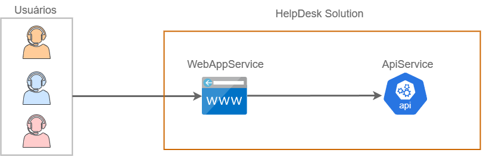
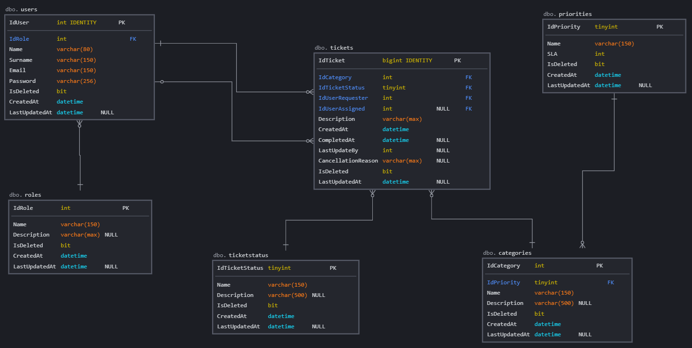
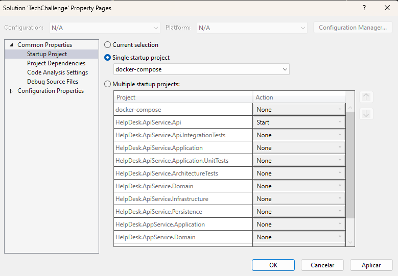
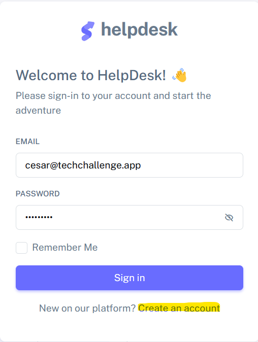
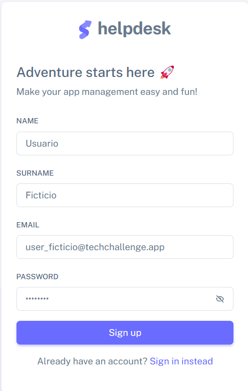
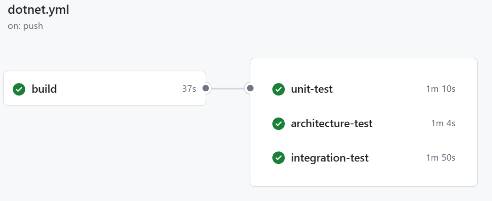

[](https://github.com/fiap-2nett/tc-fase4-clean-architecture/actions/workflows/dotnet.yml)

# Clean Architecture

Com o objetivo de manter o foco na criação de uma solução aderente ao Clean Architecture (Arquitetura Limpa) que é um dos entregáveis
do Tech Challenge 4. Foi reaproveitado o trabalho entregue no Tech Challenge 2.

Caso queira verificar o projeto entregue na fase anterior, vide link abaixo.:

- [Tech Challenge 2](https://github.com/fiap-2nett/tc-fase2-pipeline)

O projeto atualizado no Tech Challenge 4 é altamente baseado em Clean Architecture (Arquitetura Limpa), ou seja,
projetado com foco na separação de preocupações e na dependência de direção única, o que significa que as partes
mais internas do sistema não conhecem as partes mais externas.

Além disso o projeto mantém uma abordagem focada na modelagem de domínios "Domain-Driven Design" (DDD) conforme visto durante o Tech Challenge 1,
ou seja, busca alinhar o desenvolvimento da solução com o domínio do problema, resultando em sistemas mais flexíveis,
compreensíveis e que melhor atendem às necessidades do negócio.

## Documentação de Requisitos

A documentação detalhada de Requisitos Funcionais (RF) e Não Funcionais (RNF) pode ser encontrada na Wiki oficial do projeto.
Além disso, temos capturas de telas do Portal HelpDesk (UI) em funcionamento.
Vide link abaixo.:

[Wiki Oficial HelpDesk API](https://github.com/fiap-2nett/tc-fase4-clean-architecture/wiki)


## Colaboradores

- [Ailton Alves de Araujo](https://www.linkedin.com/in/ailton-araujo-b4ba0520/) - RM350781
- [Bruno Fecchio Salgado](https://www.linkedin.com/in/bfecchio/) - RM350780
- [Cecília Gonçalves Wlinger](https://www.linkedin.com/in/cec%C3%ADlia-wlinger-6a5459100/) - RM351312
- [Cesar Julio Spaziante](https://www.linkedin.com/in/cesar-spaziante/) - RM351311
- [Paulo Felipe do Nascimento de Sousa](https://www.linkedin.com/in/paulo-felipe06/) - RM351707

## Tecnologias Utilizadas

- .NET 7.0
- Entity Framework Core 7.0
- FluentValidation 11.7
- FluentAssertions 6.12
- NetArchTest 1.3
- Serilog 7.0
- Seq
- XUnit 2.4
- SqlServer 2019
- Razor
- Docker 24.0.5
- Docker Compose 2.20

## Arquitetura, Padrões Arquiteturais e Convenções

- REST Api
- Clean Architecture
- EF Code-first
- Service Pattern
- Repository Pattern & Unit Of Work
- Architecture Tests
- Integration Tests
- Unit Tests

## Desenho de Arquitetura

A solução foi arquitetada da seguinte maneira.:



Temos de frente a aplicação HelpDesk.AppService representada na imagem como "WebAppService", que é o Portal HelpDesk (UI) onde
os clientes, analistas e administradores farão a iteração com o sistema de atendimento de Ticket.
As ações efetuadas pelos usuários por meio do Portal do HelpDesk são enviadas via requisições "Rest API" para a aplicação
HelpDesk.ApiService representada na imagem como "ApiService" responsável pelo recebimento, processamento e respostas das
ações dos usuário para o Portal HelpDesk.

Ou seja, a parte de apresentação ao usuário está concentrada no projeto HelpDesk.AppService enquanto toda a lógica de negócio está isolada no projeto
HelpDesk.ApiService o que corrobora com o desacoplamento dos componentes de nossa solução.


Ambos os projetos contam com a mesma estruturação de arquitetura, vide à seguir.:

| Camada                                           | Descrição                                                                                                                                                      |
|--------------------------------------------------|----------------------------------------------------------------------------------------------------------------------------------------------------------------|
| Presentation                                     | Contempla a parte de iteração dos usuários, bem como os endpoints disponiveis para receber requisições de API.                                                 |
| Application                                      | Responsável por integrar e intermediar as camadas de "Presentation" e "Domain". No Portal HelpDesk por exemplo, coordena as operações entre a UI e o "Domain". |
| Domain                                           | Camada que concentra toda à regra de negócio da aplicação, com todos os componentes de domínio que são imprescindíveis ao negócio. Seria o "coração" da aplicação se fizéssemos uma analogia.|
| Infrastructure                                   | Fornece acesso à todos os recursos técnicos necessários para o funcionamento da solução como Banco de Dados, Logs, Gerenciamento de Arquivos e APIs Externas. Em resumo essa camada contém componentes que lidam com detalhes de baixo nível e são geralmente independentes das regras de negócio da aplicação.|

## Modelagem de dados

A HelpDesk API utiliza o paradigma de CodeFirst através dos recursos disponibilizados pelo Entity Framework, no entanto para melhor
entendimento da modelagem de dados apresentamos a seguir o MER e suas respectivas definições:



Com base na imagem acima iremos detalhar as tabelas e os dados contidos em cada uma delas:

| Schema | Tabela       | Descrição                                                                                       |
|--------|--------------|-------------------------------------------------------------------------------------------------|
| dbo    | users        | Tabela que contém os dados referentes aos usuários da plataforma.                               |
| dbo    | roles        | Tabela que contém os dados referentes aos tipos de perfis de usuário da plataforma.             |
| dbo    | tickets      | Tabela que contém os dados referentes aos tickets criados na plataforma.                        |
| dbo    | ticketstatus | Tabela que contém os dados referentes aos possíveis status de tickets.                          |
| dbo    | categories   | Tabela que contém os dados referentes às categorias de tickets.                                 |
| dbo    | priorities   | Tabela que contém os dados referentes às prioridades/SLAs relacionado às categorias de tickets. |

## Como executar

A HelpDesk API utiliza como banco de dados o SQL Server 2019 e para o Frontend foi utilizado a sintaxe de marcação Razor.
Toda a infraestrutura necessária para execução deve ser provisionada automaticamente configurando
o docker-compose como projeto de inicialização no Visual Studio.



Também é possível executar a solução diretamente sem a necessidade do Visual Studio, para tal apenas necessitamos
do Docker previamente instalado. Para executar a solução diretamente através do Docker, abra um terminal no diretório
raíz do projeto e execute o seguinte comando:

```sh
$ docker compose up -d
```

Após rodar o projeto a iteração pode ser feita pelo link abaixo.:

https://localhost:5002/

Alguns usuários fictícios com diferentes perfis de acesso são criados para logar e testar o Portal Helpdesk:

| Usuário                   | Senha       | Perfil        |
|---------------------------|-------------|---------------|
| admin@techchallenge.app   | Admin@123   | Administrador |
| ailton@techchallenge.app  | Ailton@123  | Geral         |
| bruno@techchallenge.app   | Bruno@123   | Analista      |
| cecilia@techchallenge.app | Cecilia@123 | Geral         |
| cesar@techchallenge.app   | Cesar@123   | Analista      |
| paulo@techchallenge.app   | Paulo@123   | Geral         |

Porém, caso queira você poderá criar o seu próprio usuário através da opção "Create an account".:



Depois basta preencher os dados cadastrais.:



*Observação: para novos usuários será atribuído o perfil Geral.*

## REST API

Caso deseje testar somente a API que integra o Backend do Portal HelpDesk é possível executar os passos e comandos do tópico anterior,
entretanto, uma vez que o projeto esteja executado deve-se acessar o seguinte link.:

https://localhost:5001/swagger/index.html

## Testes Unitários, Integração e Arquiteturais

A HelpDesk disponibiliza testes automatizados para garantir que o processo contempla as regras de negócio pré-definidas no requisito
do projeto. Os testes são executados via Github CI/CD Pipeline conforme aprendemos durante o Tech Challenge 2.:



Se preferir, os testes também podem ser executados localmente via dotnet CLI. Para isso rode os comandos abaixo.:
```sh
$ dotnet test tests/HelpDesk.ApiService.Application.UnitTests/HelpDesk.ApiService.Application.UnitTests.csproj --no-build --verbosity normal
$ dotnet test tests/HelpDesk.ApiService.ArchitectureTests/HelpDesk.ApiService.ArchitectureTests.csproj --no-build --verbosity normal
$ dotnet test tests/HelpDesk.ApiService.Api.IntegrationTests/HelpDesk.ApiService.Api.IntegrationTests.csproj --no-build --verbosity normal
```

Caso queira executar todos os projetos de teste, execute o comando:

```sh
$ dotnet test TechChallenge.sln
```

Caso queria uma versão de resultado com mais detalhes, execute o seguinte comando:

```sh
$ dotnet test --logger "console;verbosity=detailed" <arquivo_do_projeto_do_teste.csproj>
```

## Rastreabilidade com Logs

Para acompanhamento de Logging estamos utilizando o Serilog, para a captura e armazenamento de logs de maneira estruturada o Seq,
o que facilita a análise e a extração de insights a partir dos logs gerados pela aplicação.

Uma vez que o projeto executado, você pode conferir os logs através do Seq pelo seguinte link:

http://localhost:8081/
